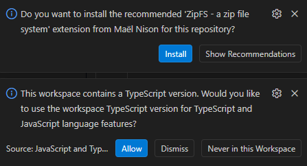

# Concord (TypeScript Version)

A TypeScript port of the Concord chat bridging application. This version adds full type safety and improved developer experience with TypeScript.

## BUILD INSTRUCTIONS:

Install NodeJS and Podman.

Change to the project root directory and run:
```bash
node bootstrap.js
```


The first time you open the project in VS Code, you will
most likely have static-checker errors everywhere that 
built-in or third-party modules are referenced.

These are not real errors. 
It will compile and run just fine with no fixes.

This is because Condor is using Yarn Berry with PnP,
instead of emitting a node_modules folder.

To get around this, the command `yarn dlx @yarnpkg/sdks ` 
can be run to generate a TypeScript SDK (found at `./.yarn/sdks/TypeSCript/`) 
This SDK knows how to use the PnP files instead for module resolution
instead of using the `./node_modules/`.

Additionally a `./.vscode/` folder is generated with a `settings.json`
that links to this SDK for VS Code to use for static analysis. Also
in the folder is an `extensions.json` which recommends the ZipFS
extension. ZipFS allows navigation & code completion of module
exports when using PnP module resolution by allowing VS Code to
access the zipped cache files found in `./.yarn/cache/`.

The `yarn dlx @yarnpkg/sdks` command has already been ran,
and the related files have been included.

When you first open the project you should get two popups
asking if you want to use the project's TypeScript version.
And if you want to install the recommended ZipFS extension.
Click Allow and Install, respectively.



You should now have full static-checking, intellisense, and
code navigation within modules.

If you didn't get the popups, just go to your extensions tab
and search for ZipFS and install it.

To change the TypeScript version open any of the .ts files 
from the `./src/` folder, then use the hotkey Ctrl + Shift + P
and choose the `TypeScript: Select TypeScript Version`
command. Pick `Use Workspace Version` and it should now
be working.